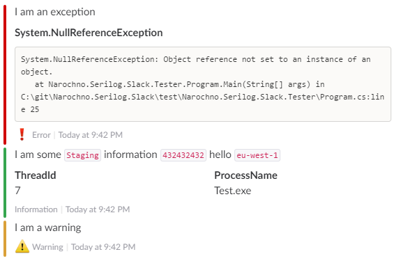

# Narochno.Serilog.Slack [](https://ci.appveyor.com/project/Narochno/narochno-serilog-slack/branch/master) [](https://www.nuget.org/packages/Narochno.Serilog.Slack/)
A batching Serilog sink for Slack, narochno. Each log message is sent as an attachment on the same message, with the log event properties rendered out as fields.



## Example Usage
```csharp
var config = new SlackConfig { WebHookUrl = "your webhook url" };

Log.Logger = new LoggerConfiguration()
    .MinimumLevel.Verbose()
    .WriteTo.Slack(config, LogEventLevel.Information)
    .CreateLogger();

Log.Information("Testing!");
```
